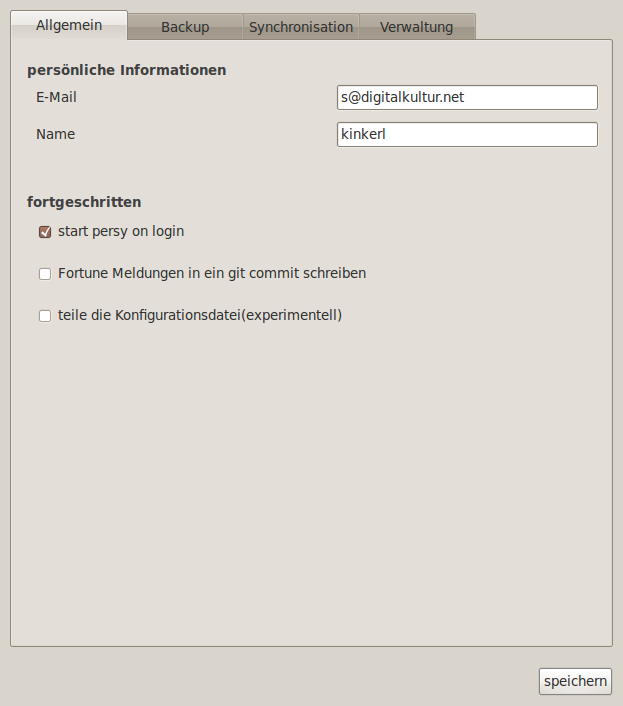
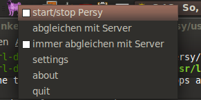

Trivia
===========================

You can always use the use_fortune configuration option found in "settings" -> "general".
Every change you do when this option is activated(True) gets a nice fortune text as a commit message! Yay!

.. literalinclude:: _tmp/fortune

New Logos
---------------------------

These are some alternative logos for persy used on the corresponding distributions.

.. csv-table:: 
  :header: "logo", "distribution"
  :widths: 128, 400

  |persy_linuxmint.svg|, "linux mint"
  |persy_fedora.svg|, "fedora"

.. |persy_fedora.svg| image:: ../usr/share/persy/assets/dist/persy_fedora.svg
   :width: 128px

Screenshots
---------------------------
.. csv-table:: 
  :header: "screen", "description"
  :widths: 128, 400

  |screen-settings-1.png|, "settings"
  |screen-settings-2.png|, "settings"
  |screen-settings-3.png|, "settings"
  |screen-settings-4.png|, "settings"
  |start_persy.png|, "menu of the statusicon"

.. |screen-settings-2.png| image:: images/screen-settings-2.png
   :width: 128px
   :target: images/screen-settings-2.png

.. |screen-settings-3.png| image:: images/screen-settings-3.png
   :width: 128px
   :target: images/screen-settings-3.png

.. |screen-settings-4.png| image:: images/screen-settings-4.png
   :width: 128px
   :target: images/screen-settings-4.png

