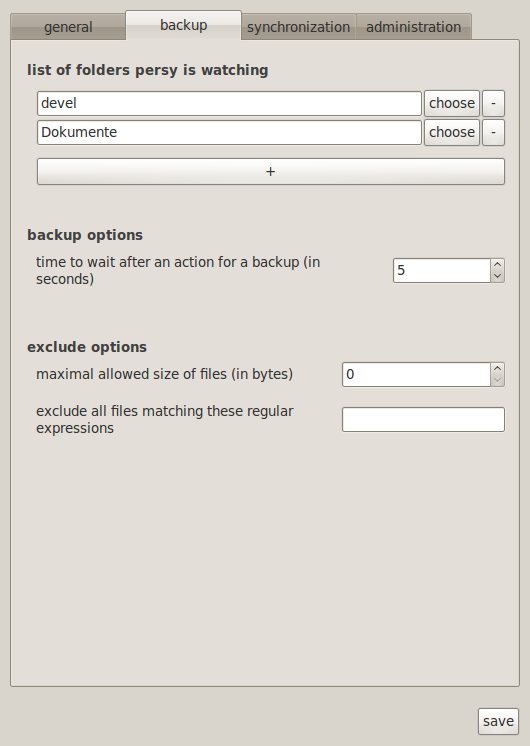

Usage
=================================

How to use persy as a normal human beeing. (if any of these explanations are not "human" enough, tell me)

Quickstart
---------------------------------

For a quick start, just run persy

.. code-block:: bash
  :linenos:

   persy

persy can also be started from the the normal startup menu in the "accessory" category.
Now you have to add directories to persy. You can do this in the settings menu into the "backup" tab (take a look at the screenshot).

The watched directories and files can be in absolute format (starts with / ) or relative to the userhome.

After you added the directories (and maybe lookt at the other configuration options too) you might want to actually start persy. just rightclick on the status icon and check the "start/stop persy" checkbox.

.. image:: images/start_persy.png

Thats it, persy should be running by now and backup your files.

Quickstart on the commandline
---------------------------------

You can also do this configuration in the commandline. This is recommended for experienced users only and is not necessary if you configured persy with the settings menu.

.. code-block:: bash
  :linenos:

   persy --config --uname=USERNAME
   persy --config --mail=MAIL
   persy --config --add_dir=DIR
   persy --start

You can configure your desktop environment to execute persy at login.

Setup for syncing and/or using a remote backup
----------------------------------------------

If you want to sync or backup your files on a remote server, you have to enable a public key authentication for the server (more information). No extra persy serversoftware is required as you can see in this illustration:

.. image:: images/sync.png

The server just needs a ssh server with public key authentication and the git-core package.

You only have to configure the client computer with persy installed! The normal workflow with a **blank remote Server** and an **already initialized local repository** is:

.. code-block:: bash
  :linenos:

   persy --config --hostname=SERVER
   persy --config --path=PATH
   persy --initRemote
   persy --start

The normal workflow with a **already initialized remote Server** and **no local repository**.

.. warning::

   the synced directories should be empty before the sync. i had some problems with already existing files. you can start a sync and then add new files to the synced directory.

.. code-block:: bash
  :linenos:

   persy --config --uname=USERNAME
   persy --config --mail=MAIL
   persy --config --hostname=SERVER
   persy --config --path=PATH
   persy --config --add_dir=DIR
   persy --syncwithremote
   persy --start

Advanced Usage
--------------------------------------------

You can use persy without a centralized server to which every clients connects and performes the synchronization (like in the illustration image above). You can also run persy without a second computer at all and synchronize with other parts(repositories) on the filesystem. Right now, this is not the intended use and i will not cover this in the cli or the upcomming gui. You can however configure this in the git configuration for persy ~/.persy/git/config and i try to take care of the internal implementation. If you have questions regarding esoteric setups, feel free to mail me.

persy's states
--------------------------------------------

When running persy, its possible to run in the following states. most of them are selfexplanatory.

.. csv-table:: 
  :header: "icon", "state"
  :widths: 64, 400

  |persy_idle.svg|, "idle, not running"
  |persy_untracked.svg|, "untracked changes local"
  |persy_unsynced.svg|, "all local changes are backupped"
  |persy_ok.svg|, "persy is in sync with the server"
  |persy_warn.svg|, "warning!"
  |persy_error.svg|, "error!"

.. |persy_idle.svg| image:: ../usr/share/persy/assets/persy_idle.svg
   :width: 64px

.. |persy_untracked.svg| image:: ../usr/share/persy/assets/persy_untracked.svg
   :width: 64px

.. |persy_unsynced.svg| image:: ../usr/share/persy/assets/persy_unsynced.svg
   :width: 64px

.. |persy_ok.svg| image:: ../usr/share/persy/assets/persy_ok.svg
   :width: 64px

.. |persy_warn.svg| image:: ../usr/share/persy/assets/persy_warn.svg
   :width: 64px

.. |persy_error.svg| image:: ../usr/share/persy/assets/persy_error.svg
   :width: 64px

